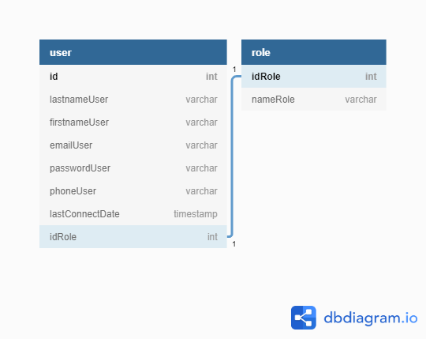
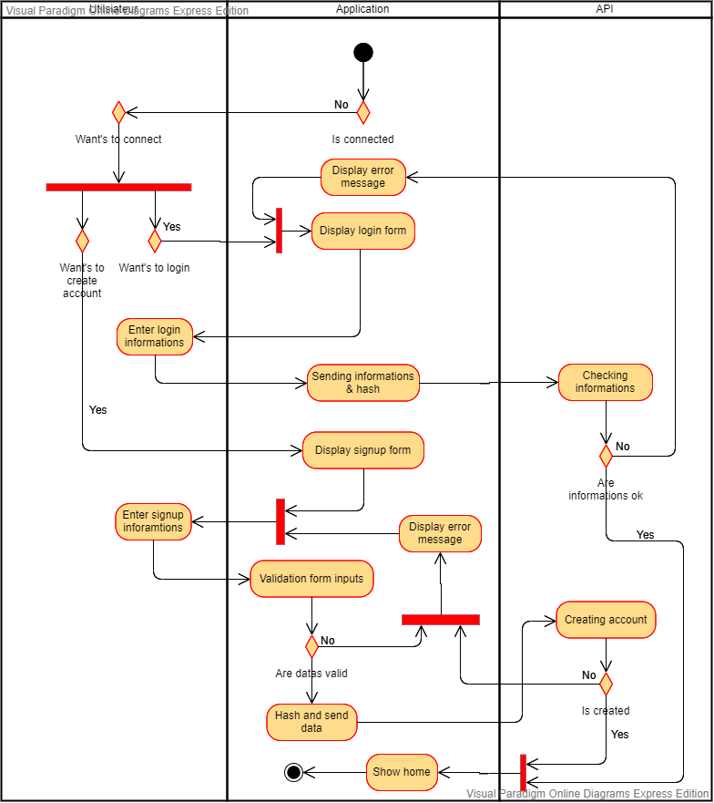

# Journal de bord

## 2020-05-05

- Création du Github
- Mise en place du système de connexion et d'inscription
- UML: J'ai fais ce modèle ci pour le projet de préparation. Il ne devrait pas y a avoir de modifications à faire sur cela.
  

- Mise en place des création de formulaires automatique pour la connexion et l'inscription. Ces formulaires sont fait avec la librairie wtforms
- Mise en place de bootstrap 4
- Ajout de la barre de navigation du site
- Mise en place de l'affichage des utilisateurs du carnet d'adresse sur la page d'accueil
- Mise en place de la modification ainsi que la suppression des utilisateur du carnet d'adresse pour un utilsaiteur étant connecté en tant qu'administrateur
- Création du diagramme d'activité pour la connexion et création de compte :

